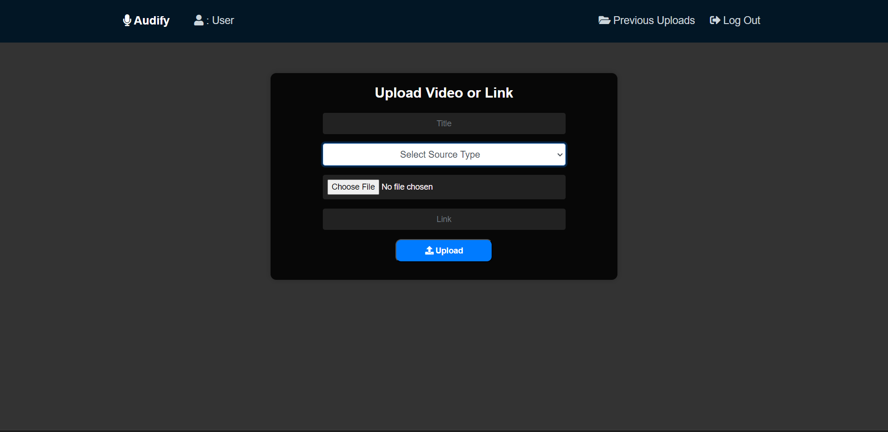
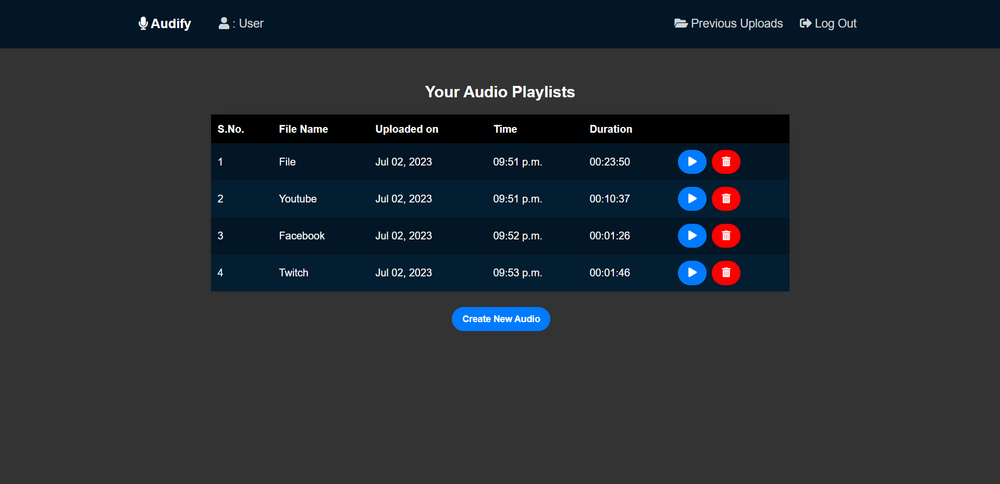
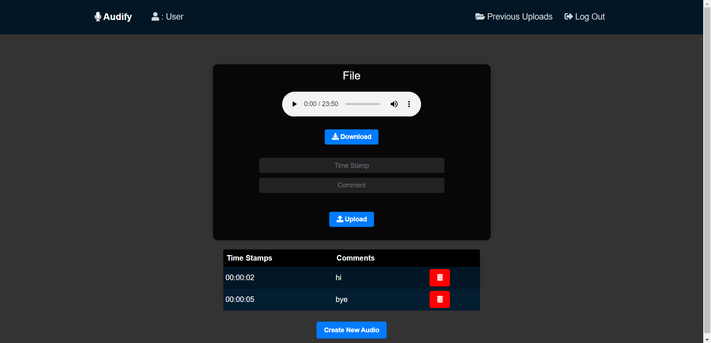

# Audify

## Overview
Audify is a web application that allows users to convert videos in various formats to audio files and add comments at specific timestamps.

## Description
This web application provides the following features:
- Conversion of uploaded videos or video links to audio files.
  - Users can upload videos from their devices in any video file format, such as .mp4 or .mov.
  - Video links from platforms like YouTube, Facebook, or Twitch can also be provided.
- User authentication for secure access.
- View and manage previous uploads.
- Add captions or comments to audio files at specific timestamps.

## Benefits of Audify

Audify offers several advantages that make it a valuable tool for users:

1. **Audio Extraction**: With Audify, users can easily extract audio from various video formats, enabling them to convert videos into audio files quickly.

2. **Timestamped Comments**: Audify allows users to add comments or captions at specific timestamps in the audio files. This feature is especially useful for annotating important sections or providing context within the audio.

3. **User-friendly Interface**: Audify provides a user-friendly web interface that simplifies the process of uploading videos, converting them to audio, and managing the files. The intuitive design makes it accessible to users of all levels of technical expertise.

4. **Previous Upload History**: Users can conveniently access and manage their previous uploads within Audify. This feature enables easy organization and retrieval of converted audio files.

5. **Cross-platform Compatibility**: Audify supports video sources from various platforms, including local device uploads, YouTube videos, Facebook videos, and Twitch streams. This versatility ensures that users can extract audio from a wide range of sources.

6. **Secure User Authentication**: Audify implements user authentication to ensure secure access to the application. This safeguard protects user data and files from unauthorized access.

By combining these benefits, Audify provides a comprehensive solution for users seeking to extract audio from videos and enhance their audio files with timestamped comments.

## Tech Stack
- Frontend: HTML, CSS, JavaScript
- Backend: Python (Django)
- Database: SQLite

## Necessary Libraries
The following libraries need to be installed to run the code:
- Django: Use the command `pip install django`.
- Pytube: Use the command `pip install pytube`. Please note that there are small bugs in pytube related to extracting videos from YouTube links. You can refer to this [fix1](https://github.com/pytube/pytube/issues/1678) and [fix2](https://stackoverflow.com/questions/68680322/pytube-urllib-error-httperror-http-error-410-gone) for resolving the issue.
- Youtube-dl: Use the command `pip install youtube_dl`.
- Moviepy: Use the command `pip install moviepy`.
- Pydub: Use the command `pip install pydub`.
- Mutagen: Use the command `pip install mutagen`.
- FFMPEG: Refer to this [guide](https://ffmpeg.org/about.html) for installation instructions.

Please make sure to install these libraries before running the code.

## Instructions
1. Clone this repository to your local machine.
2. Install the necessary libraries as mentioned above.
3. Run the Django server using the command `python manage.py runserver`.
4. Access the web application through your web browser by visiting `http://localhost:8000`.

## Website Images

## Demo

https://github.com/Nitish-Kumar0/Audify/assets/109269353/ac7c470f-df5d-4968-b616-9be449a71faf

Enjoy using Audify and convert your videos to audio with ease!
